<!-- Replace elite-mob with your GitHub username in all URLs below if different -->

### ⌨️ Typing Intro

---

### 📊 Profile Statistics

---

### 🔥 Contribution Streak & Stats

---

### 📈 Contribution Activity

---

### 🐍 Contribution Snake

---

### 📌 Pinned Repositories

---

### 🏆 GitHub Trophies

---

### 💬 Random Dev Quote

---

### 🛠️ Tech Stack

---

### 🌍 Visitors Around the World

---

### 📫 Connect With Me

<!-- Update these links with your actual profiles -->

---

### ☕ Support

---

---

## About Me

I'm a senior full-stack software engineer focused on building production-ready web and mobile applications for real users. I've shipped and maintained systems end to end, from product discovery and UI design through backend implementation, deployment, and long-term support.

My work spans backend, frontend, mobile, and infrastructure. I build complete products, not just features. That includes public-facing websites, internal dashboards, mobile apps, admin panels, and integrations that actually hold up in production.

**What I focus on day to day:**
- **Backend** — Node.js and Python, REST and event-driven systems, background jobs, third-party integrations, and payment flows
- **Frontend** — TypeScript and React, performance, state management, and pragmatic UX
- **Mobile** — React Native, native iOS and Android integrations, app architecture, performance tuning, and store releases
- **Data** — SQL, schema design, migrations, reporting, and data integrity
- **Infrastructure** — AWS, Docker, CI/CD pipelines, monitoring, and production incident handling
- **Architecture** — System design and tradeoffs that keep systems understandable and scalable
- **AI/ML** — LLM integrations in production with attention to cost control, validation, and reliability

I prefer boring, well-understood solutions over clever ones. I care about clean ownership, predictable behavior, and code that's still easy to reason about months after it ships.

If you have a project in mind, feel free to reach out to discuss it further. I focus on delivering work that's actually useful, shipped cleanly, and handled professionally from start to finish.
